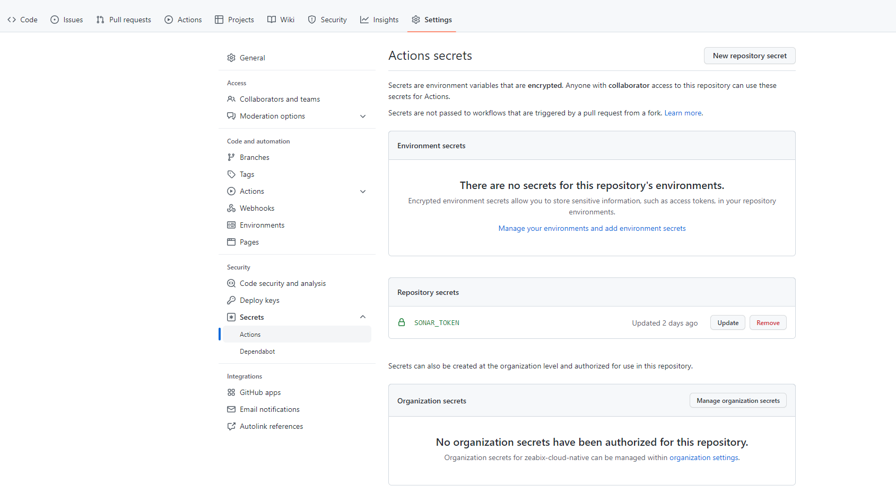
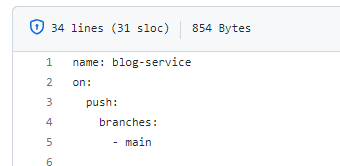

# pttgc-devops-lab04
This module will give attendees best practice to handle all kinds of sensitive information that are required during the software building process, such as token, password, etc.

We will also correct our mistake from `devops-lab03` which we leave the credential inside the workflow definition file

## Exercise 1 - Using GitHub Action Secret (Repository)
- Attendee can reuse the same repository from `devops-lab03` (previous lab)
- Go to GitHub UI, in the repository that you are currently working on and then click `Settings-->Actions-->Secrets`



- Click `New repository secret` to create secret name `SONAR_TOKEN` with the value of your SonarCloud token that you retrieved from previous lab

- Open your workflow file and replace your hard-coded token with this value
```yaml
        env:
          SONAR_TOKEN: ${{ secrets.SONAR_TOKEN }}
```

- Commit and push the code, then go to GitHub UI to see how your workflow is running


There are 3 types of secrets in GitHub Action which are
- Repository Secret
- Organization Secret
- Environment Secret


## Exercise 2 - Using Organization Secrets
The Repository Secrets are available and can be used within a repository. Sometimes it is difficult to governance. The Organization Secrets is the way to centralize the secrets, they are able to shared across the repositories in the organization.

In this exercise we will replace the `Repository Secrets` that we used in the previous exercise with `Organization Secrets`

- Attendee can reuse the same repository from `devops-lab03` (previous lab)
- Go to GitHub UI, in the repository that you are currently working on and then click `Settings-->Actions-->Secrets`

- Click `Manage organization secrets`
- Click `New organization secrets`
- Enter name `SHARED_SONAR_TOKEN` and put the token from your SonarCloud as its value
- You can select the level of the share secret, either All repositories, Private repositories or even specific repositories. For the lab we will select `All Repositories`, but for real usage, you should consider really carefully.
- Update your workflow to use the secret from organization secrets instead
```yaml
        env:
          SONAR_TOKEN: ${{ secrets.SHARED_SONAR_TOKEN }}
```
- Commit and push the code, then go to GitHub UI to see how your workflow is running


*NOTE: In this lab we will cover only two types of secrets, the Environment Secrets will be in the separate topic*


## Exercise 3 - Protect workflow by using CODEOWNERS
You can protect directory `.github/workflows` by using feature `CODEOWNERS`. Any changes for any files in `.github/workflows` will need to be reviewed and approved by the person/team that specified in the `CODEOWNERS` files

- Use the same repository
- Create `CODEOWNERS` file at the root level of the repository
```
\.github\ @<your-github-user>
#For example
\.github\ @puizeabix
```
- Commit and push code, and open the any file inside `.github/workflows`, you will see the small icon indicated that this file is protected.




### Naming your secrets
- Secret names can only contain alphanumeric characters ([a-z], [A-Z], [0-9]) or underscores (_). Spaces are not allowed.

- Secret names must not start with the GITHUB_ prefix.

- Secret names must not start with a number.

- Secret names are not case-sensitive.

- Secret names must be unique at the level they are created at.

For example, a secret created at the environment level must have a unique name in that environment, a secret created at the repository level must have a unique name in that repository, and a secret created at the organization level must have a unique name at that level.

If a secret with the same name exists at multiple levels, the secret at the lowest level takes precedence. For example, if an organization-level secret has the same name as a repository-level secret, then the repository-level secret takes precedence. Similarly, if an organization, repository, and environment all have a secret with the same name, the environment-level secret takes precedence.

*Reference [https://docs.github.com/en/actions/security-guides/encrypted-secrets#naming-your-secrets](https://docs.github.com/en/actions/security-guides/encrypted-secrets#naming-your-secrets)